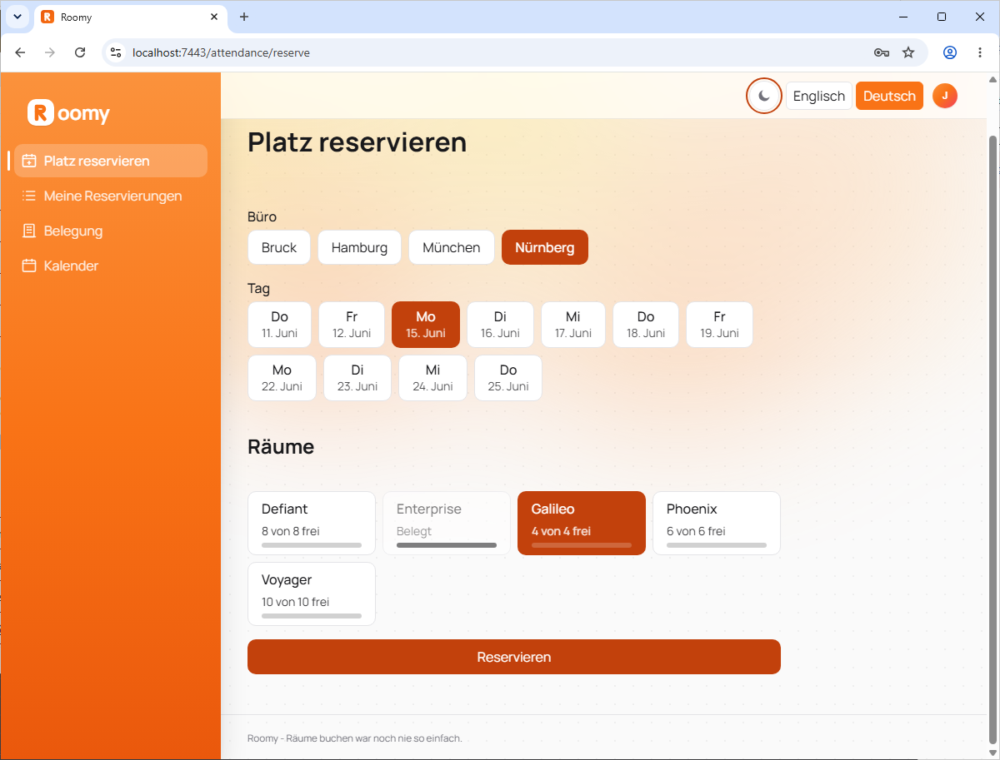
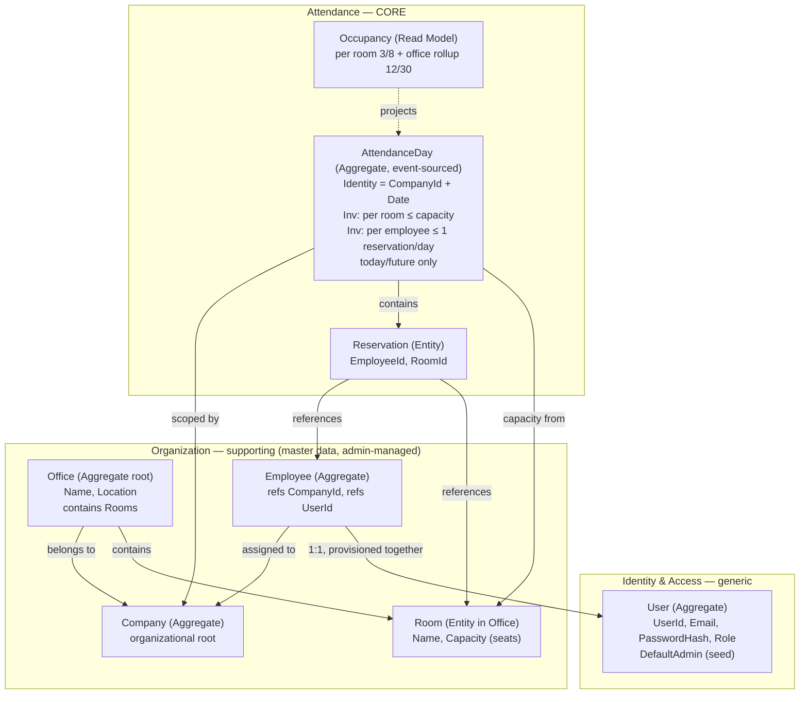
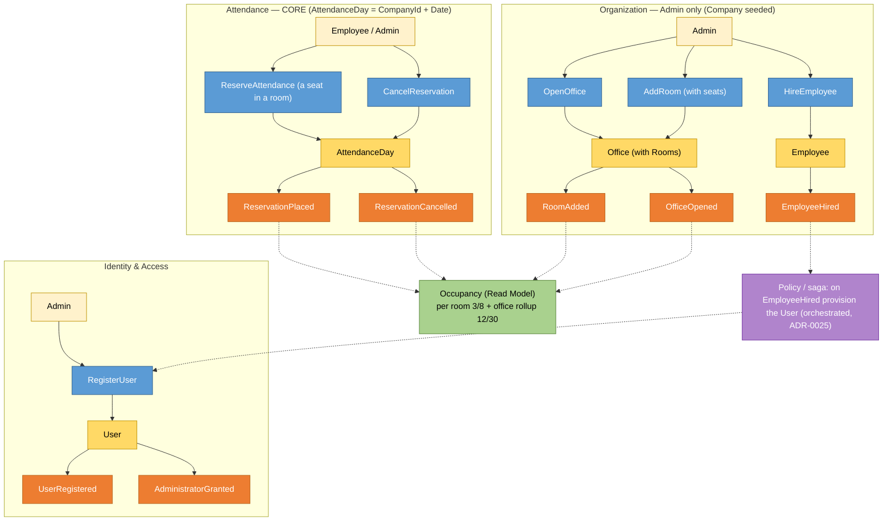
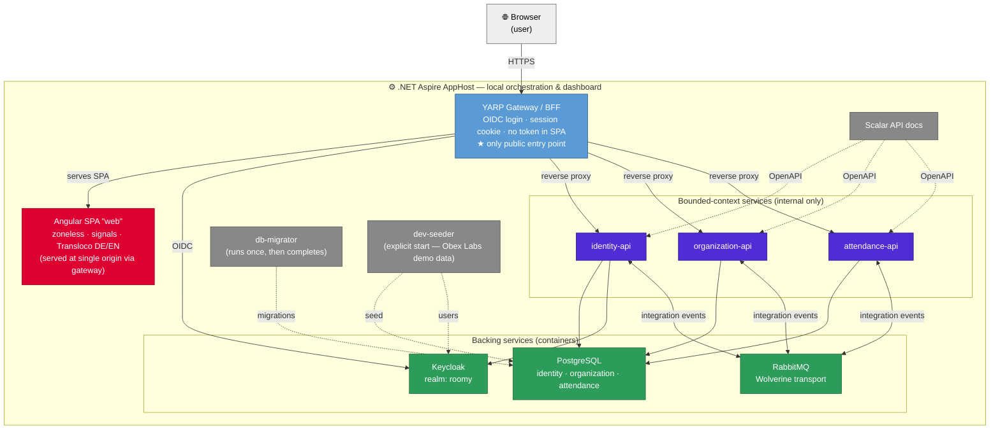
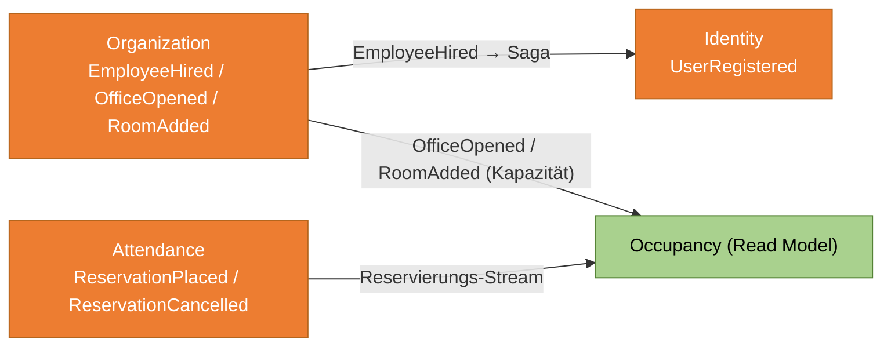

<p align="center">
  
</p>

<p align="center">
  <em>Booking rooms has never been this easy.</em>
</p>

<p align="center">
  <strong>B2B office-attendance planning</strong> · .NET 10 · DDD &amp; event-driven · Angular 22 · Keycloak · .NET Aspire
</p>

---

> **B2B office-attendance planning.** Teams plan and coordinate who is in which office,
> on which day, in which room — so a hybrid workforce always knows where there is a desk.

Roomy is a full, running reference application: a Domain-Driven, event-driven system of
three independently deployable bounded contexts behind a single gateway, with a zoneless
Angular front end, Keycloak-backed authentication, and one-command local orchestration via
.NET Aspire.

🇬🇧 **English** below · 🇩🇪 [**Deutsch weiter unten**](#-roomy--deutsch)

📐 Looking for build, test, and contribution details? See the
[**Engineering README**](README.engineering.md).

---

## 1. What Roomy does

An administrator sets up the company's **offices** and **rooms** (each with a seat
capacity) and **hires employees**. Every employee can then **reserve a seat** in a room for
a given working day. The system guarantees two invariants at all times:

- a room is never overbooked beyond its capacity, and
- an employee holds at most one reservation per day.

Live **occupancy** (per room, e.g. `3/8`, and rolled up per office, e.g. `12/30`) is
projected from the reservation stream so planners see fill levels at a glance.

The domain is split into three bounded contexts, each its own deployable service with its
own database. They never share a database or join across services — they integrate only
through **asynchronous integration events**.

| Context | Subdomain | Owns | Feature spec |
|---|---|---|---|
| **Identity & Access** | Generic | Users, roles, authentication | [`001-identity-access`](specs/001-identity-access) |
| **Organization** | Supporting | Companies, offices, rooms, employees | [`002-office-management`](specs/002-office-management) |
| **Attendance** | **Core** | Attendance days, reservations, occupancy read model | [`003-attendance`](specs/003-attendance), [`004-occupancy`](specs/004-occupancy) |

> The full context map and architecture rules live in [`CLAUDE.md`](CLAUDE.md); the rationale
> behind every decision is recorded in [`docs/adr/`](docs/adr/); features are specified in
> [`specs/`](specs/).

---

## 1a. The app

The front end carries the Roomy brand — the orange brand tile + wordmark — in an orange
left sidebar holding the primary navigation (*Reserve a place · My reservations · Occupancy ·
Calendar*), with theme and DE/EN language toggles and the account menu top-right. The screen
below is **Reserve a place**: pick an office, pick a day, then pick a room — each room tile
shows free seats (`X von Y frei`) and a fill bar. Full DE/EN switching and a WCAG 2.2 AA
baseline throughout (ADR-0047, ADR-0024).

<p align="center">
  
</p>

> Want other views? Run the app (see [§4](#4-run-it-as-a-new-developer)) and capture the
> **Offices** admin grid, **Occupancy**, or the **Calendar**; drop the PNGs into
> `docs/assets/` and add them here.

---

## 2. Data model — DDD with events

Aggregates are the consistency boundaries; behaviour lives on them; cross-context facts
travel as events. The diagrams below render directly on GitHub (Mermaid).

### 2.1 Aggregates & relationships



### 2.2 Commands, events & policies (event storming)



**Key event flows.**

- **Hire → provision** is a cross-context **saga**: Organization raises `EmployeeHired`,
  Identity reacts by registering the `User` and provisioning the Keycloak account, with the
  1:1 link reconciled by eventual consistency (ADR-0025).
- **Occupancy** is *not* a fourth service. It is a read model inside Attendance, fed
  `OfficeOpened`/`RoomAdded` (for capacity) from Organization and projected from the
  reservation stream (ADR-0038).
- **AttendanceDay is event-sourced** (`ReservationPlaced` / `ReservationCancelled`), with
  optimistic-concurrency retry owned by its repository (ADR-0039, ADR-0055).

The canonical sources are [`docs/roomy-event-storming.mermaid`](docs/roomy-event-storming.mermaid)
and [`docs/roomy-context-map.mermaid`](docs/roomy-context-map.mermaid).

---

## 3. System diagram — all components

Everything below is started and wired together by a single **.NET Aspire** AppHost.



| Component | Role |
|---|---|
| **Aspire AppHost** | Orchestrates every process/container; exposes the dashboard |
| **Angular SPA (`web`)** | The UI; zoneless + signals; served single-origin through the gateway (ADR-0030) |
| **YARP Gateway / BFF** | The only public entry point; handles OIDC login, holds the session cookie, proxies to the APIs (ADR-0013) |
| **identity-api / organization-api / attendance-api** | The three context services, internal only |
| **Keycloak** | Self-hosted OIDC provider (realm `roomy`) |
| **PostgreSQL** | One database per context — no shared schema |
| **RabbitMQ** | Wolverine transport for integration events + outbox/inbox |
| **db-migrator** | Applies EF Core migrations, then exits (ADR-0033) |
| **dev-seeder** | Loads the *Obex Labs* demo dataset (offices, ~42 employees, reservations) — explicit start |
| **Scalar** | Interactive OpenAPI documentation per service (ADR-0042) |

---

## 4. Run it as a new developer

You need: **.NET 10 SDK** (pinned in [`global.json`](global.json)), **Node.js 20+**,
**pnpm 10+**, and a **container runtime** (Docker Desktop or Podman) for Postgres,
RabbitMQ, and Keycloak.

```bash
# 1. Install toolchains
pnpm install
dotnet restore Roomy.slnx

# 2. Start the whole system (from the AppHost)
dotnet run --project backend/apps/apphost
```

Then:

1. **Open the Aspire dashboard.** The console prints a login URL with a one-time token,
   e.g. `https://localhost:17285/login?t=...`. Open it — the dashboard lists every
   resource, its endpoints, logs, and traces.
2. **Start the front end and demo data.** The `web` and `dev-seeder` resources are marked
   *explicit start* — in the dashboard, press **Start** on **`dev-seeder`** (wait for it to
   complete) and on **`web`**.
3. **Open the app at the gateway URL.** In the dashboard, open the external **HTTPS**
   endpoint of the **`gateway`** resource (e.g. `https://localhost:7443`). **This gateway
   URL is the one and only URL you use for testing** — never the individual API or SPA
   ports. Accept the local dev certificate if prompted.
4. **Log in** with one of the accounts below.

> First start pulls container images and runs migrations, so give it a minute. Teardown:
> stop the AppHost; the Postgres/RabbitMQ/Keycloak containers are persistent by design and
> keep your data between runs.

### Most important logins

| Who | Username / Email | Password | Use it for |
|---|---|---|---|
| **Roomy Admin** | `admin@roomy.local` | `Test1234!` | Full app: manage offices, rooms, hire employees, reserve |
| **Normal user (employee)** | `jean-luc.picard@obexlabs.com` | `Test1234!` | Employee view: reserve a seat, see occupancy *(needs the seeder)* |
| **Keycloak admin console** | `admin` | *generated — see dashboard* | The Keycloak admin UI (realm `roomy`, users, clients) |

- **All seeded employees** follow `firstname.lastname@obexlabs.com` (e.g.
  `data@obexlabs.com`, `kathryn.janeway@obexlabs.com`) with the same password
  `Test1234!`. Names come from the *Obex Labs* dataset in
  [`backend/apps/dev-seeder`](backend/apps/dev-seeder).
- The **Keycloak admin password** is a generated secret. Find it in the Aspire dashboard:
  open the **`keycloak`** resource → **Parameters / Environment** (`keycloak-password`).
- Roomy Admin and the employees are all **real Keycloak users** — login goes through the
  Keycloak page presented by the gateway's BFF flow; no token ever reaches the browser.

---

## 5. Deployment

Roomy runs anywhere its backing services do; nothing is cloud-locked.

- **Azure** — the intended target is **Azure Container Apps**, with the Aspire app model
  publishing the services, plus Azure Database for PostgreSQL and Azure Service Bus as the
  message transport (ADR-0017). Messaging is transport-agnostic (ADR-0015), so the broker
  swaps by configuration.
- **AWS** — the same containers deploy to ECS/Fargate or EKS with RDS for PostgreSQL and
  SQS+SNS as the transport — again, a configuration swap, not a code change (ADR-0015).

The gateway stays the single public ingress in every environment; the context services and
backing infrastructure remain private.

---

## 6. How this was built — AI-assisted, spec-first

Roomy was developed **with AI agents as the primary implementers**, working under a strict,
auditable process — this repository is as much a demonstration of *that workflow* as of the
product.

- **Spec-first, test-first.** Every change traces to a Spec Kit spec with testable
  acceptance criteria in [`specs/`](specs/); each criterion becomes a *failing* test before
  any implementation. One story per short-lived branch, atomic Conventional Commits,
  rebase-and-merge.
- **Decisions are recorded.** Any structural or cross-cutting choice gets an ADR in
  [`docs/adr/`](docs/adr/) *before* the implementing code — 60+ ADRs capture the reasoning.
- **The agent operates under a written contract.** [`CLAUDE.md`](CLAUDE.md) is the canonical
  operating contract: golden rules, architecture boundaries, the work loop, and coding
  conventions the agent must follow.
- **Guardrails, not vibes.** Quality is enforced by gates, not trust: Nx module-boundary
  lint, NetArchTest dependency-rule tests, nullable + analyzers as errors, a coverage floor,
  OpenAPI-client drift checks, and full-stack saga e2e tests — all green before merge.
- **AI posture in the product.** Product AI is deferred for v1 but kept AI-ready behind owned
  abstractions, and Roomy exposes an MCP server for agent access (ADR-0023).

The result is a codebase where *why* (ADR), *what* (spec + test), and *how* (commit) are all
traceable — exactly so AI-generated code stays reviewable and correct.

> **A candid note on the process.** I leaned heavily on AI for this project and used it as
> the primary implementer. I deliberately tried **spec-driven development** end to end — writing
> the spec and acceptance criteria first, then letting the agent implement against them. In
> practice it was far from hands-off: I adjusted a great deal along the way — tightening specs,
> correcting course, reshaping the design — and a lot of the polish came from **prompting
> targeted refactorings** rather than accepting the first output. The honest takeaway is that
> spec-first + AI gets you a strong, consistent baseline quickly, but the quality bar is still
> set by the human steering it: deciding what to keep, what to rework, and what to throw away.

---

## 7. Where to go next

- [**Engineering README**](README.engineering.md) — prerequisites, build, test, lint, CI gates
- [`CLAUDE.md`](CLAUDE.md) — operating contract, context map, architecture rules
- [`CONTRIBUTING.md`](CONTRIBUTING.md) — branching, commits, PR workflow
- [`docs/adr/`](docs/adr/) — architecture decision records (the *why*)
- [`docs/architecture.md`](docs/architecture.md) — living high-level overview
- [`docs/testing-strategy.md`](docs/testing-strategy.md) — the testing pyramid and gates
- [`specs/`](specs/) — feature specs, plans, and tasks

---
---

# 🇩🇪 Roomy — Deutsch

> **B2B-Büroanwesenheitsplanung.** Teams planen und koordinieren, wer an welchem Tag in
> welchem Büro und in welchem Raum ist — damit eine hybride Belegschaft immer weiß, wo ein
> Platz frei ist.

Roomy ist eine vollständige, lauffähige Referenzanwendung: ein Domain-getriebenes,
event-getriebenes System aus drei unabhängig deploybaren Bounded Contexts hinter einem
einzigen Gateway, mit einem zoneless Angular-Frontend, Keycloak-gestützter
Authentifizierung und lokaler Orchestrierung per **.NET Aspire** mit einem Befehl.

📐 Build-, Test- und Beitragsdetails stehen in der
[**Engineering-README**](README.engineering.md).

---

## 1. Was Roomy macht

Ein Administrator legt die **Büros** und **Räume** des Unternehmens an (jeder mit einer
Platzkapazität) und **stellt Mitarbeitende ein**. Jede:r Mitarbeitende kann dann für einen
Arbeitstag einen **Platz in einem Raum reservieren**. Das System garantiert jederzeit zwei
Invarianten:

- ein Raum wird nie über seine Kapazität hinaus belegt, und
- ein:e Mitarbeitende:r hält höchstens eine Reservierung pro Tag.

Die Live-**Belegung** (pro Raum, z. B. `3/8`, und je Büro aufsummiert, z. B. `12/30`) wird
aus dem Reservierungs-Stream projiziert, sodass Planende die Auslastung auf einen Blick
sehen.

Die Domäne ist in drei Bounded Contexts aufgeteilt — jeder ein eigener deploybarer Service
mit eigener Datenbank. Sie teilen sich **nie** eine Datenbank und joinen nicht über
Servicegrenzen — die Integration erfolgt ausschließlich über **asynchrone Integration
Events**.

| Kontext | Subdomäne | Verantwortet | Feature-Spec |
|---|---|---|---|
| **Identity & Access** | Generisch | Benutzer, Rollen, Authentifizierung | [`001-identity-access`](specs/001-identity-access) |
| **Organization** | Unterstützend | Unternehmen, Büros, Räume, Mitarbeitende | [`002-office-management`](specs/002-office-management) |
| **Attendance** | **Kern** | Anwesenheitstage, Reservierungen, Belegungs-Read-Model | [`003-attendance`](specs/003-attendance), [`004-occupancy`](specs/004-occupancy) |

> Die vollständige Context Map und die Architekturregeln stehen in [`CLAUDE.md`](CLAUDE.md);
> die Begründung jeder Entscheidung in [`docs/adr/`](docs/adr/); Features in
> [`specs/`](specs/).

---

## 1a. Die App

Das Frontend trägt die Roomy-Marke — die orangefarbene Marken-Kachel + Wortmarke — in einer
orangefarbenen linken Seitenleiste mit der Hauptnavigation (*Platz reservieren · Meine
Reservierungen · Belegung · Kalender*); Theme- und DE/EN-Sprachumschalter sowie das
Konto-Menü liegen oben rechts. Der Screen unten ist **Platz reservieren**: Büro wählen, Tag
wählen, dann Raum wählen — jede Raum-Kachel zeigt freie Plätze (`X von Y frei`) und einen
Auslastungsbalken. Durchgängig DE/EN-Wechsel und WCAG-2.2-AA-Basis (ADR-0047, ADR-0024).

<p align="center">
  
</p>

> Weitere Ansichten? Die App starten (siehe [§4](#4-als-neue-entwicklerin-starten)) und die
> **Büros**-Verwaltung, **Belegung** oder den **Kalender** aufnehmen; PNGs nach
> `docs/assets/` legen und hier ergänzen.

---

## 2. Datenmodell — DDD mit Events

Aggregate sind die Konsistenzgrenzen; Verhalten liegt auf ihnen; kontextübergreifende
Fakten reisen als Events. Die Diagramme oben in Abschnitt 2 des englischen Teils rendern
direkt auf GitHub (Mermaid) und gelten unverändert — hier die Kernpunkte:

- **Hire → Provisionierung** ist eine kontextübergreifende **Saga**: Organization löst
  `EmployeeHired` aus, Identity reagiert mit dem Registrieren des `User` und der
  Keycloak-Provisionierung; die 1:1-Verknüpfung wird über *eventual consistency* hergestellt
  (ADR-0025).
- **Occupancy** ist *kein* vierter Service, sondern ein Read Model innerhalb von Attendance,
  gespeist aus `OfficeOpened`/`RoomAdded` (Kapazität) und projiziert aus dem
  Reservierungs-Stream (ADR-0038).
- **AttendanceDay ist event-sourced** (`ReservationPlaced` / `ReservationCancelled`); das
  Optimistic-Concurrency-Retry liegt im Repository (ADR-0039, ADR-0055).

Kanonische Quellen: [`docs/roomy-event-storming.mermaid`](docs/roomy-event-storming.mermaid)
und [`docs/roomy-context-map.mermaid`](docs/roomy-context-map.mermaid).



---

## 3. Systemdiagramm — alle Komponenten

Das vollständige Komponentendiagramm steht im englischen [Abschnitt 3](#3-system-diagram--all-components).
Alles wird von einem einzigen **.NET-Aspire-AppHost** gestartet und verdrahtet:

| Komponente | Rolle |
|---|---|
| **Aspire AppHost** | Orchestriert alle Prozesse/Container; stellt das Dashboard bereit |
| **Angular-SPA (`web`)** | Die Oberfläche; zoneless + Signals; Single-Origin über das Gateway (ADR-0030) |
| **YARP Gateway / BFF** | Der einzige öffentliche Eingang; OIDC-Login, Session-Cookie, Proxy zu den APIs (ADR-0013) |
| **identity-/organization-/attendance-api** | Die drei Kontext-Services, ausschließlich intern |
| **Keycloak** | Selbst gehosteter OIDC-Provider (Realm `roomy`) |
| **PostgreSQL** | Eine Datenbank pro Kontext — kein gemeinsames Schema |
| **RabbitMQ** | Wolverine-Transport für Integration Events + Outbox/Inbox |
| **db-migrator** | Wendet EF-Core-Migrationen an und beendet sich (ADR-0033) |
| **dev-seeder** | Lädt den *Obex-Labs*-Demodatensatz (Büros, ~42 Mitarbeitende, Reservierungen) — explicit start |
| **Scalar** | Interaktive OpenAPI-Dokumentation je Service (ADR-0042) |

---

## 4. Als neue:r Entwickler:in starten

Voraussetzungen: **.NET 10 SDK** (fixiert in [`global.json`](global.json)), **Node.js 20+**,
**pnpm 10+** und eine **Container-Laufzeit** (Docker Desktop oder Podman) für Postgres,
RabbitMQ und Keycloak.

```bash
# 1. Toolchains installieren
pnpm install
dotnet restore Roomy.slnx

# 2. Das gesamte System starten (über den AppHost)
dotnet run --project backend/apps/apphost
```

Danach:

1. **Aspire-Dashboard öffnen.** Die Konsole gibt eine Login-URL mit Einmal-Token aus, z. B.
   `https://localhost:17285/login?t=...`. Öffnen — das Dashboard listet alle Ressourcen,
   Endpunkte, Logs und Traces.
2. **Frontend und Demodaten starten.** Die Ressourcen `web` und `dev-seeder` sind auf
   *explicit start* gesetzt — im Dashboard **`dev-seeder`** per **Start** ausführen (bis
   *Completed* warten) und **`web`** starten.
3. **Die App über die Gateway-URL öffnen.** Im Dashboard den externen **HTTPS**-Endpunkt der
   Ressource **`gateway`** öffnen (z. B. `https://localhost:7443`). **Diese Gateway-URL ist
   die einzige URL zum Testen** — niemals die einzelnen API- oder SPA-Ports. Bei Bedarf das
   lokale Dev-Zertifikat akzeptieren.
4. **Anmelden** mit einem der Konten unten.

> Der erste Start lädt Container-Images und führt Migrationen aus — etwas Geduld. Herunterfahren:
> AppHost stoppen; die Postgres-/RabbitMQ-/Keycloak-Container sind bewusst persistent und
> behalten die Daten zwischen Läufen.

### Die wichtigsten Logins

| Wer | Benutzername / E-Mail | Passwort | Wofür |
|---|---|---|---|
| **Roomy-Admin** | `admin@roomy.local` | `Test1234!` | Volle App: Büros/Räume verwalten, einstellen, reservieren |
| **Normale:r Nutzer:in (Mitarbeiter:in)** | `jean-luc.picard@obexlabs.com` | `Test1234!` | Mitarbeitersicht: Platz reservieren, Belegung sehen *(braucht den Seeder)* |
| **Keycloak-Admin-Konsole** | `admin` | *generiert — siehe Dashboard* | Keycloak-Admin-UI (Realm `roomy`, Nutzer, Clients) |

- **Alle geseedeten Mitarbeitenden** folgen `vorname.nachname@obexlabs.com` (z. B.
  `data@obexlabs.com`, `kathryn.janeway@obexlabs.com`) mit demselben Passwort
  `Test1234!`. Die Namen stammen aus dem *Obex-Labs*-Datensatz in
  [`backend/apps/dev-seeder`](backend/apps/dev-seeder).
- Das **Keycloak-Admin-Passwort** ist ein generiertes Secret. Im Aspire-Dashboard unter der
  Ressource **`keycloak`** → **Parameter / Environment** (`keycloak-password`).
- Roomy-Admin und Mitarbeitende sind **echte Keycloak-Nutzer** — der Login läuft über die
  Keycloak-Seite des BFF-Flows; es erreicht **nie** ein Token den Browser.

---

## 5. Deployment

Roomy läuft überall dort, wo seine Backing-Services laufen; nichts ist Cloud-gebunden.

- **Azure** — Zielplattform sind **Azure Container Apps**, mit dem Aspire-App-Modell zum
  Publizieren der Services, dazu Azure Database for PostgreSQL und Azure Service Bus als
  Transport (ADR-0017). Das Messaging ist transport-agnostisch (ADR-0015) — der Broker wird
  per Konfiguration getauscht.
- **AWS** — dieselben Container laufen auf ECS/Fargate oder EKS mit RDS für PostgreSQL und
  SQS+SNS als Transport — ebenfalls nur Konfiguration, keine Codeänderung (ADR-0015).

Das Gateway bleibt in jeder Umgebung der einzige öffentliche Eingang; die Kontext-Services
und die Backing-Infrastruktur bleiben privat.

---

## 6. Wie das entstanden ist — KI-gestützt, spec-first

Roomy wurde **mit KI-Agenten als primären Implementierenden** entwickelt, unter einem
strengen, prüfbaren Prozess — dieses Repository demonstriert ebenso sehr *diesen Workflow*
wie das Produkt.

- **Spec-first, test-first.** Jede Änderung verweist auf eine Spec-Kit-Spec mit testbaren
  Akzeptanzkriterien in [`specs/`](specs/); jedes Kriterium wird zuerst zu einem
  *fehlschlagenden* Test, bevor implementiert wird. Eine Story je kurzlebigem Branch, atomare
  Conventional Commits, rebase-and-merge.
- **Entscheidungen werden festgehalten.** Jede strukturelle oder querschnittliche
  Entscheidung erhält ein ADR in [`docs/adr/`](docs/adr/) — *vor* dem Code; 60+ ADRs halten
  die Begründungen fest.
- **Der Agent arbeitet unter einem schriftlichen Vertrag.** [`CLAUDE.md`](CLAUDE.md) ist der
  kanonische Operating Contract: Golden Rules, Architekturgrenzen, Work Loop und
  Coding-Konventionen.
- **Guardrails statt Bauchgefühl.** Qualität wird durch Gates erzwungen: Nx-Modulgrenzen-Lint,
  NetArchTest-Abhängigkeitsregeln, Nullable + Analyzer als Fehler, eine Coverage-Untergrenze,
  OpenAPI-Client-Drift-Checks und Full-Stack-Saga-E2E-Tests — alles grün vor dem Merge.
- **KI-Haltung im Produkt.** Produkt-KI ist für v1 zurückgestellt, aber hinter eigenen
  Abstraktionen vorbereitet; Roomy stellt einen MCP-Server für Agentenzugriff bereit
  (ADR-0023).

Das Ergebnis ist eine Codebasis, in der *Warum* (ADR), *Was* (Spec + Test) und *Wie* (Commit)
durchgängig nachvollziehbar sind — genau damit KI-generierter Code prüfbar und korrekt bleibt.

> **Ein offenes Wort zum Vorgehen.** Ich habe für dieses Projekt stark auf KI gesetzt und sie
> als primäre Implementierung genutzt. Bewusst habe ich **Spec-Driven Development** durchgängig
> ausprobiert — erst Spec und Akzeptanzkriterien, dann den Agenten dagegen implementieren
> lassen. In der Praxis war das keineswegs „hands-off“: Ich habe unterwegs **viel angepasst** —
> Specs geschärft, Kurs korrigiert, das Design umgeformt — und einen großen Teil des Feinschliffs
> durch **gezieltes Prompten von Refactorings** erreicht, statt die erste Ausgabe zu übernehmen. Das
> ehrliche Fazit: Spec-first + KI liefert schnell eine starke, konsistente Basis, aber die
> Qualitätslatte legt weiterhin der Mensch fest, der steuert — was bleibt, was überarbeitet und
> was verworfen wird.

---

## 7. Weiterführend

- [**Engineering-README**](README.engineering.md) — Voraussetzungen, Build, Test, Lint, CI-Gates
- [`CLAUDE.md`](CLAUDE.md) — Operating Contract, Context Map, Architekturregeln
- [`CONTRIBUTING.md`](CONTRIBUTING.md) — Branching, Commits, PR-Workflow
- [`docs/adr/`](docs/adr/) — Architecture Decision Records (das *Warum*)
- [`docs/architecture.md`](docs/architecture.md) — fortlaufende High-Level-Übersicht
- [`docs/testing-strategy.md`](docs/testing-strategy.md) — Testpyramide und Gates
- [`specs/`](specs/) — Feature-Specs, Pläne und Tasks
